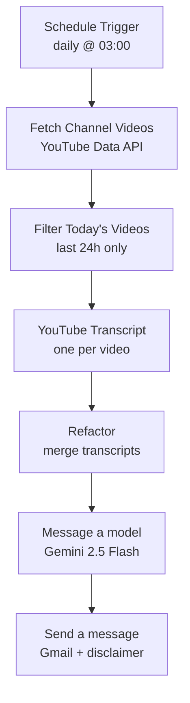

# premarket-brief

A small n8n workflow that wakes up every morning, pulls the last 24 hours of videos from a single Hindi stock-market YouTube channel, fetches the transcripts, and uses Gemini to turn them into a disciplined English pre-market brief — then emails it to you.

The whole thing is built around one rule: treat the channel as **one commentator's narrative, not as market data**. The model prompt does a lot of work to separate facts from speculation, flag company names it isn't sure about, strip out the "subscribe / link in description" noise, and never invent tickers or numbers.

> **Heads-up:** this summarizes one person's opinions off YouTube. It is **not** investment advice. See [Disclaimer](#disclaimer).

---

## What it does



Step by step:

1. **Schedule Trigger** — fires once a day at 03:00 (server time).
2. **Fetch Channel Videos** — calls the YouTube Data API for the channel's recent uploads.
3. **Filter Today's Videos** — keeps only what was published in the last 24 hours.
4. **YouTube Transcript** — pulls the raw transcript for each surviving video.
5. **Refactor** — merges every transcript into one block, each prefixed with its video title.
6. **Message a model** — Gemini 2.5 Flash writes the brief as clean inline-styled HTML.
7. **Send a message** — Gmail delivers it, with a SEBI disclaimer prepended to the body.

The output email is sectioned and skimmable: **TL;DR → Key Market Themes → Today's Calendar & Triggers → Stocks & Sectors in Focus → (optional) Deep Dive → Analyst Calls & Price Targets → Macro & Global Cues → Risks & Caveats → Bottom Line.** Empty sections collapse instead of being padded.

---

## Requirements

- A running **n8n** instance (self-hosted via Docker, or n8n Cloud).
- The community node **[`@cryptodevops/n8n-nodes-youtube-transcript`](https://www.npmjs.com/package/@cryptodevops/n8n-nodes-youtube-transcript)** for transcript extraction.
- Three credentials:
  - **YouTube Data API v3 key** (Google Cloud Console).
  - **Google Gemini API key** — added in n8n as a *Google Gemini (PaLM) API* credential.
  - **Gmail OAuth2** — or swap the send node for Telegram / WhatsApp (see [Changing the delivery channel](#changing-the-delivery-channel)).

The Gemini node ships with n8n's built-in `@n8n/n8n-nodes-langchain` package, so nothing extra to install there.

---

## Setup

1. **Import the workflow.** In n8n: *Workflows → Import from File →* `premarket-brief.json`.
2. **Install the transcript node.** *Settings → Community Nodes → Install →* `@cryptodevops/n8n-nodes-youtube-transcript`.
3. **Add the three credentials** (YouTube API key, Gemini, Gmail) and attach them to their nodes.
4. **Point it at your channel.** Set the `playlistId` on the *Fetch Channel Videos* node (see below).
5. **Set the recipient and time.** Update `sendTo` on the *Send a message* node, and `triggerAtHour` on the *Schedule Trigger* to match your timezone.
6. **Activate** the workflow.

### Finding your channel's uploads playlist

Every YouTube channel has a hidden "uploads" playlist that contains all its videos. You don't need a third-party API to find it — just take the channel ID and swap the prefix:

```
Channel ID:        UC hneGqGy_lmvfcR1v_avL6g
Uploads playlist:  UU hneGqGy_lmvfcR1v_avL6g
```

Replace `UC` with `UU`, drop that into `playlistId`, and you're done. The default in this repo points at **Stock Market का Commando**.

---

## Configuration

The knobs you'll actually touch:

| Setting | Node | Default | Notes |
|---|---|---|---|
| Run time | Schedule Trigger | `03:00` server time | `triggerAtHour` |
| Source channel | Fetch Channel Videos | `UUhneGqGy_lmvfcR1v_avL6g` | uploads playlist ID |
| Videos pulled | Fetch Channel Videos | `20` | `maxResults` |
| Lookback window | Filter Today's Videos | `24 hours` | edit the JS `cutoff` line |
| Model | Message a model | `gemini-2.5-flash` | |
| Temperature | Message a model | `0.3` | kept low for factual output |
| Recipient | Send a message | `you@example.com` | `sendTo` |

### Changing the delivery channel

The memory of why Gmail is here is simple: it's the easiest to set up. To send to **Telegram** or **WhatsApp** instead, delete the *Send a message* (Gmail) node and connect *Message a model* to a Telegram / WhatsApp node. The Gemini output is HTML, so for Telegram you'll either want to strip the tags or switch the prompt's `OUTPUT FORMAT` block to plain text / Markdown.

---

## Repo structure

```
premarket-brief/
├── premarket-brief.json   # the n8n workflow export
└── README.md
```

---

## Security

Before you commit anything:

- **Don't hardcode your YouTube API key in the JSON.** Use an n8n credential or an environment variable on the HTTP node. A key sitting in a public repo gets scraped and abused within minutes.
- If a key has ever been exposed, **rotate it** in Google Cloud — deleting the commit isn't enough, Git history keeps it.
- Replace your real recipient email with a placeholder before pushing.

The n8n `credentials` blocks in the export (Gmail OAuth2, Gemini) are just internal credential **IDs**, not the secrets themselves, so those are safe to leave in.

---

## Disclaimer

This workflow produces an **AI-generated summary of publicly available YouTube videos from a single third-party channel.** It is created by an automated tool and is **not reviewed for accuracy** — it may contain errors, omissions, misheard names, or wrong figures.

It is shared for **informational and educational purposes only.** It is **not investment advice**, nor a recommendation, offer, or solicitation to buy or sell any security. The views summarized are the original video creator's, not the maintainer's.

The maintainer is **not a SEBI-registered Research Analyst, Investment Adviser, or financial professional of any kind**, and nothing here should be treated as a research report or professional advice. Securities markets carry risk, including loss of capital; past performance does not indicate future results. **Always do your own research and consult a SEBI-registered adviser before investing.**

The same disclaimer is auto-injected into every email the workflow sends, so recipients see it too.

---

## License

MIT — do whatever you like, no warranty. (Add a `LICENSE` file if you want it to show up properly on GitHub.)
