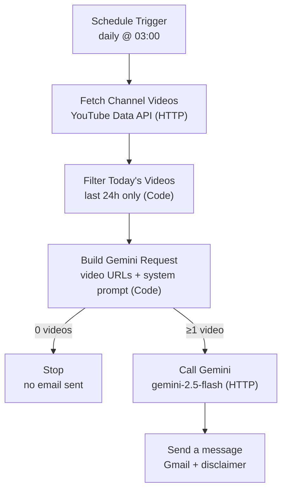

# premarket-brief

A small n8n workflow that wakes up every morning, pulls the last 24 hours of videos from a single Hindi stock-market YouTube channel, and hands the videos **directly to Gemini** — which watches them server-side and turns them into a disciplined English pre-market brief, then emails it to you.

The whole thing is built around one rule: treat the channel as **one commentator's narrative, not as market data**. The model prompt does a lot of work to separate facts from speculation, flag company names it isn't sure about, cross-check them against on-screen text, strip out the "subscribe / link in description" noise, and never invent tickers or numbers.

> **Heads-up:** this summarizes one person's opinions off YouTube. It is **not** investment advice. See [Disclaimer](#disclaimer).

---

## What it does



Step by step:

1. **Schedule Trigger** — fires once a day at 03:00 (server time).
2. **Fetch Channel Videos** — an HTTP request to the YouTube Data API (`playlistItems`) for the channel's uploads playlist, newest 10.
3. **Filter Today's Videos** — a Code node that keeps only videos published in the last 24 hours, emitting one item per video.
4. **Build Gemini Request** — a Code node that sorts the videos oldest→newest (so "recency wins" works), takes up to 10, and assembles the Gemini `generateContent` body: the long analyst system prompt plus each video's URL as a `fileData` part. **If nothing was published in the last 24h it returns nothing and the run stops — no empty email.**
5. **Call Gemini** — an HTTP POST to `gemini-2.5-flash`. Gemini fetches each video server-side and analyzes the spoken Hindi audio *and* the on-screen visuals (charts, tickers, figures) directly. Retries once on failure, 10-minute timeout.
6. **Send a message** — Gmail delivers the HTML brief, with a SEBI disclaimer prepended to the body.

### Why no transcripts?

Earlier versions scraped each video's transcript with a community node, then merged the text. YouTube started IP-blocking that scraping from the n8n host. The fix (this is `premarket-brief-v3`) was to stop scraping entirely and pass the **video URLs straight to Gemini** — Google fetches the videos server-side, so the host machine's IP block no longer matters, and the model gets the on-screen charts and tickers too, not just a noisy auto-transcript. The old transcript and merge nodes are gone.

The output email is sectioned and skimmable: **TL;DR → Key Market Themes → Today's Calendar & Triggers → Stocks & Sectors in Focus → (optional) Deep Dive → Analyst Calls & Price Targets → Macro & Global Cues → Risks & Caveats → Bottom Line.** Every stock and theme is tagged with the channel's stance using a fixed set — `[Bullish] [Bearish] [Cautious] [Neutral] [Hype - unverified]` — and empty sections collapse instead of being padded.

---

## Requirements

- A running **n8n** instance (self-hosted via Docker, or n8n Cloud).
- Two credentials/keys:
  - **YouTube Data API v3 key** (Google Cloud Console) — used by the *Fetch Channel Videos* HTTP node.
  - **Google Gemini API key** — added in n8n as a *Google Gemini (PaLM) API* credential (`googlePalmApi`), used by the *Call Gemini* HTTP node.
  - **Gmail OAuth2** — or swap the send node for Telegram / WhatsApp (see [Changing the delivery channel](#changing-the-delivery-channel)).

No community nodes are required — every step is a built-in **HTTP Request**, **Code**, or **Gmail** node.

---

## Setup

1. **Import the workflow.** In n8n: *Workflows → Import from File →* `premarket-brief.json`.
2. **Add the credentials.** Attach the Gemini (`googlePalmApi`) credential to *Call Gemini* and the Gmail OAuth2 credential to *Send a message*. Put your YouTube Data API key into the `key` query parameter on *Fetch Channel Videos* (replace `YOUR_YOUTUBE_API_KEY`) — ideally via an n8n credential or env var rather than inline (see [Security](#security)).
3. **Point it at your channel.** Set the `playlistId` on the *Fetch Channel Videos* node (see below).
4. **Set the recipient and time.** Update `sendTo` (and optionally `bccList`) on the *Send a message* node, and `triggerAtHour` on the *Schedule Trigger* to match your timezone.
5. **Activate** the workflow.

### Finding your channel's uploads playlist

Every YouTube channel has a hidden "uploads" playlist that contains all its videos. You don't need a third-party API to find it — just take the channel ID and swap the prefix:

```
Channel ID:        UC hneGqGy_lmvfcR1v_avL6g
Uploads playlist:  UU hneGqGy_lmvfcR1v_avL6g
```

Replace `UC` with `UU`, drop that into `playlistId`, and you're done. The default in this repo points at **Stock Market का Commando**.

---

## Configuration

The knobs you'll actually touch:

| Setting | Node | Default | Notes |
|---|---|---|---|
| Run time | Schedule Trigger | `03:00` server time | `triggerAtHour` |
| Source channel | Fetch Channel Videos | `UUhneGqGy_lmvfcR1v_avL6g` | uploads playlist ID |
| Videos pulled | Fetch Channel Videos | `10` | `maxResults` query param |
| Lookback window | Filter Today's Videos | `24 hours` | edit the JS `cutoff` line |
| Max videos to Gemini | Build Gemini Request | `10` | Gemini's per-request video cap |
| Model | Call Gemini | `gemini-2.5-flash` | in the request URL |
| Temperature | Build Gemini Request | `0.3` | `generationConfig`, kept low for factual output |
| Timeout / retries | Call Gemini | `10 min` / `2 tries` | `timeout`, `maxTries`, 5s wait between |
| Recipient | Send a message | `your@email.com` | `sendTo` (+ `bccList`) |

### Changing the delivery channel

Gmail is here because it's the easiest to set up. To send to **Telegram** or **WhatsApp** instead, delete the *Send a message* (Gmail) node and connect *Call Gemini* to a Telegram / WhatsApp node — the model's reply lives at `$json.candidates[0].content.parts[0].text`. The Gemini output is HTML, so for Telegram you'll either want to strip the tags or switch the prompt's `OUTPUT FORMAT` block to plain text / Markdown.

---

## Repo structure

```
premarket-brief/
├── premarket-brief.json   # the n8n workflow export (premarket-brief-v3)
├── LICENSE
└── README.md
```

---

## Security

Before you commit anything:

- **Don't hardcode your YouTube API key in the JSON.** It currently sits as a `key` query parameter on the *Fetch Channel Videos* node (placeholder `YOUR_YOUTUBE_API_KEY`). Use an n8n credential, an env var, or an expression instead — a key sitting in a public repo gets scraped and abused within minutes.
- If a key has ever been exposed, **rotate it** in Google Cloud — deleting the commit isn't enough, Git history keeps it.
- Replace your real recipient/BCC emails with placeholders before pushing.

The n8n `credentials` blocks in the export (Gmail OAuth2, Gemini) are just internal credential **IDs**, not the secrets themselves, so those are safe to leave in.

---

## Disclaimer

This workflow produces an **AI-generated summary of publicly available YouTube videos from a single third-party channel.** It is created by an automated tool and is **not reviewed for accuracy** — it may contain errors, omissions, misheard names, or wrong figures.

It is shared for **informational and educational purposes only.** It is **not investment advice**, nor a recommendation, offer, or solicitation to buy or sell any security. The views summarized are the original video creator's, not the maintainer's.

The maintainer is **not a SEBI-registered Research Analyst, Investment Adviser, or financial professional of any kind**, and nothing here should be treated as a research report or professional advice. Securities markets carry risk, including loss of capital; past performance does not indicate future results. **Always do your own research and consult a SEBI-registered adviser before investing.**

The same disclaimer is auto-injected into every email the workflow sends, so recipients see it too.

---

## License

MIT — do whatever you like, no warranty. See the [`LICENSE`](LICENSE) file.
